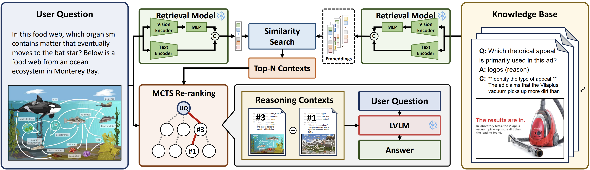
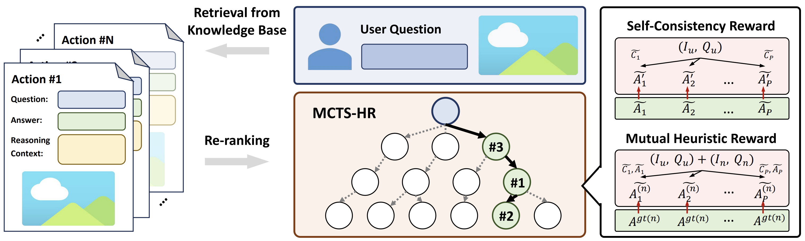
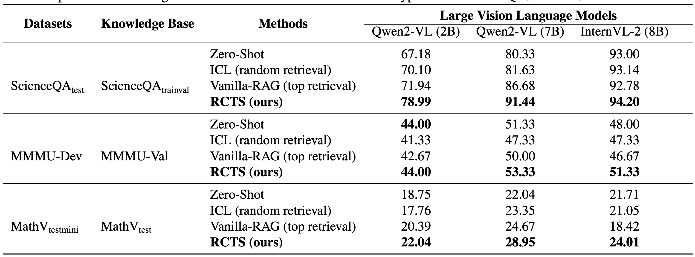

# RCTS-RAG: Re-ranking Reasoning Context with Tree Search Makes Large Vision-Language Models Stronger

[](https://arxiv.org/pdf/2506.07785)
[](https://icml.cc/)
[](https://www.python.org/downloads/)
[](https://pytorch.org/)

**Authors**: [Qi Yang](https://yannqi.github.io/), Chenghao Zhang, Lubin Fan, Kun Ding, Jieping Ye, [Shiming Xiang](https://people.ucas.ac.cn/~xiangshiming)

This repository provides the official PyTorch implementation for **RCTS-RAG**, a novel approach that enhances Large Vision-Language Models (LVLMs) through re-ranking reasoning contexts using Monte Carlo Tree Search (MCTS). Our method has been accepted as a **Spotlight Paper** at ICML 2025.

## 🪵 TODO List

- [X] ✅ Release core implementation
- [X] ✅ Complete README documentation
- [X] ✅ Add configuration examples
- [ ] 🔄 Add More detailed Quick Start.

## 🔥 What's New

- **(2025.5.1)** 🎉 Our paper (RCTS) is accepted as **ICML 2025 Spotlight Paper**!
- **(2025.5.6)** 📄 Paper released on arXiv
- **(2025.8.31)** 🚀 Released the complete implementation code

## 📖 Abstract

RCTS-RAG introduces a novel framework that combines Retrieval-Augmented Generation (RAG) with Monte Carlo Tree Search to improve the reasoning capabilities of Large Vision-Language Models. Our approach:

- 🎯 **Re-ranks reasoning contexts** using MCTS to find optimal reasoning paths
- 🧠 **Enhances multi-modal understanding** by integrating visual and textual information
- 📊 **Achieves state-of-the-art performance** on multiple vision-language benchmarks
- 🔄 **Supports multiple query modes** including hybrid, text-only, and random retrieval

## 🏗️ Architecture





Our RCTS-RAG framework consists of three main components:

1. **Multi-modal Retrieval System**: Retrieves relevant contexts using hybrid text-image embeddings
2. **MCTS Re-ranking Module**: Explores and evaluates different reasoning paths using tree search
3. **Enhanced LVLMs**: Generates final answers based on re-ranked contexts

## 📊 Supported Datasets

RCTS-RAG supports evaluation on five major vision-language benchmarks:

- 🧮 **MathVista (MathV)**: Mathematical reasoning with visual elements
- 🎓 **ScienceQA**: Science question answering with diagrams
- 🔬 **MMMU**: Massive Multi-discipline Multimodal Understanding
- 👁️ **VizWiz**: Visual question answering for the visually impaired
- 🎯 **VSR (Visual Spatial Reasoning)**: Spatial reasoning tasks

## 🛠️ Installation

### Prerequisites

- Python 3.8+
- PyTorch 1.13+
- CUDA (recommended for GPU acceleration)

### Setup Environment

```bash
# Clone the repository
git clone https://github.com/yannqi/RCTS-RAG.git
cd RCTS-RAG

# Create conda environment
conda create -n rcts-rag python=3.8
conda activate rcts-rag

# Install dependencies
pip install -r requirements.txt
```

### Key Dependencies

- `torch>=1.13.0`: Deep learning framework
- `transformers>=4.30.0`: Hugging Face transformers
- `faiss-cpu>=1.7.4`: Vector similarity search
- `flmr>=0.1.0`: Fine-grained Late-interaction Multi-modal Retriever
- `openai>=1.0.0`: OpenAI API support
- `omegaconf>=2.3.0`: Configuration management

## 🚀 Quick Start

### 1. Data Preparation

Configure your dataset paths in `configs/dataset_path.yaml`:

```yaml
dataset_path:
  ScienceQA: "/path/to/ScienceQA"
  MathV: "/path/to/MathVista"
  MMMU: "/path/to/MMMU"
  VizWiz: "/path/to/VizWiz"
  VSR_MC: "/path/to/VSR"
```

### 2. Index Construction

Build vector indices for retrieval:

```bash
# Example for ScienceQA
bash scripts/Index_Construct/ScienceQA_index.sh
```

### 3. Chain-of-Thought (CoT) Construction

Generate reasoning chains for MCTS:

```bash
# Example for ScienceQA
bash scripts/CoT_Construct/ScienceQA_CoT.sh
```

### 4. Run Evaluation

Execute RCTS-RAG on your chosen dataset:

```bash
# With MCTS re-ranking
bash scripts/RAG/ScienceQA_RAG_mcts_query.sh

# With hybrid query (no MCTS)
bash scripts/RAG/ScienceQA_RAG_hybrid_query.sh

# Without RAG (baseline)
bash scripts/RAG/ScienceQA_woRAG.sh
```

## 📁 Project Structure

```
RCTS-RAG/
├── configs/                    # Configuration files
│   ├── main/                  # Main experiment configs
│   ├── CoT_Pred/              # CoT prediction configs
│   ├── extract_info/          # Information extraction configs
│   └── index_save/            # Index construction configs
├── data/                      # Dataset implementations
│   ├── ScienceQA.py          # ScienceQA dataset loader
│   ├── MathV.py              # MathVista dataset loader
│   ├── MMMU.py               # MMMU dataset loader
│   ├── VizWiz.py             # VizWiz dataset loader
│   └── VSR_MC.py             # VSR dataset loader
├── module/                    # Core modules
│   ├── RAG/                  # RAG implementation
│   │   ├── RCTS_RAG.py       # Main RAG class
│   │   └── answer.py         # Answer generation
│   ├── mcts/                 # MCTS implementation
│   │   ├── mcts_llm.py       # MCTS with LLM
│   │   └── mcts_reranking.py # Re-ranking logic
│   ├── model/                # Model implementations
│   │   ├── llm.py            # LLM interfaces
│   │   ├── embedding_model.py # Embedding models
│   │   └── query.py          # Query strategies
│   └── storage/              # Storage utilities
├── scripts/                   # Execution scripts
│   ├── RAG/                  # RAG experiment scripts
│   ├── CoT_Construct/        # CoT construction scripts
│   ├── Index_Construct/      # Index building scripts
│   └── evaluate/             # Evaluation scripts
└── tools/                    # Utility tools
    ├── CoT_extract.py        # CoT extraction
    ├── extract_img_feats.py  # Image feature extraction
    └── Index_construct.py    # Index construction
```

## ⚙️ Configuration

RCTS-RAG uses YAML configuration files for flexible experimentation. Key configuration categories:

### Main Experiment Config

Located in `configs/main/`, controls:

- Dataset selection
- Query modes (hybrid, text, MCTS)
- RAG parameters
- Model settings

### Query Modes

- **Hybrid Query**: Combines text and image embeddings
- **Text Query**: Text-only retrieval
- **MCTS Query**: Uses Monte Carlo Tree Search for re-ranking
- **Random Query**: Baseline random retrieval

### Example Configuration

```yaml
# configs/main/ScienceQA_mctsquery.yaml
LOG_DIR: "outputs/ScienceQA_mcts"
DATASET_NAME: "ScienceQA"
USE_RAG: true
USE_MCTS: true
TOP_K: 3
MCTS_TOP_K: 5
MCTS_ROLLOUTS: 10
QUERY_MODE: "hybrid_query"
INDEX_TYPE: "Hybrid_PreFLMR"
```

## 📈 Evaluation

### Run Single Dataset

```bash
# Evaluate on ScienceQA with MCTS
python main_baseline.py configs/main/ScienceQA_mctsquery.yaml

# Evaluate on MathVista without RAG
python main_baseline.py configs/main/MathV_woRAG.yaml
```

### Batch Evaluation

```bash
# Run all ScienceQA experiments
bash scripts/evaluate/eval_all_scienceqa.sh
```

## 🎯 Key Features

### 🔄 Monte Carlo Tree Search

- **Exploration**: Systematically explores different reasoning paths
- **Evaluation**: Uses reward models to assess path quality
- **Selection**: Chooses optimal reasoning contexts

### 🔍 Multi-modal Retrieval

- **Hybrid Embeddings**: Combines text and image representations
- **FLMR Integration**: Uses Fine-grained Late-interaction Multi-modal Retriever
- **Efficient Indexing**: FAISS-based vector storage for fast retrieval

### 🧠 Enhanced Reasoning

- **Context Re-ranking**: Orders retrieved contexts by relevance
- **Chain-of-Thought**: Leverages step-by-step reasoning
- **Multi-turn Interaction**: Supports iterative reasoning processes

## 📊 Results

Our RCTS-RAG achieves significant improvements across multiple benchmarks.



*Results may vary based on model configurations and computational resources.*

## 🤝 Citing RCTS

```
@misc{yang2025rerankingreasoningcontexttree,
      title={Re-ranking Reasoning Context with Tree Search Makes Large Vision-Language Models Stronger}, 
      author={Qi Yang and Chenghao Zhang and Lubin Fan and Kun Ding and Jieping Ye and Shiming Xiang},
      year={2025},
      eprint={2506.07785},
      archivePrefix={arXiv},
      primaryClass={cs.CV},
      url={https://arxiv.org/abs/2506.07785}, 
}
```
